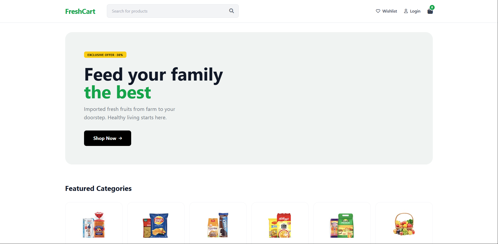
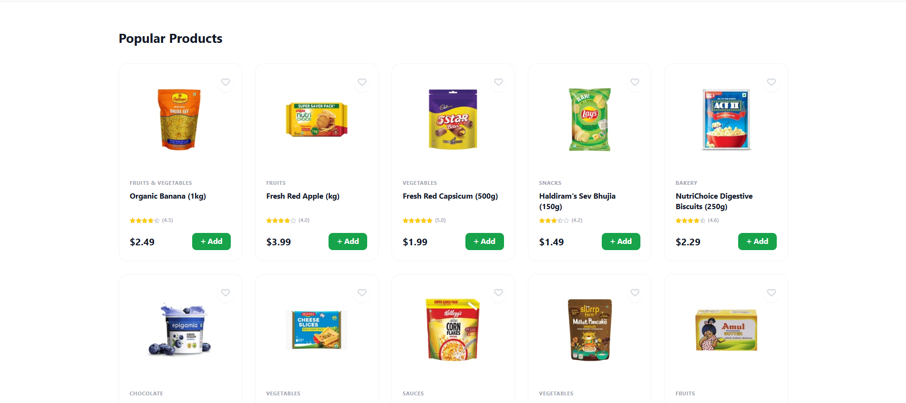
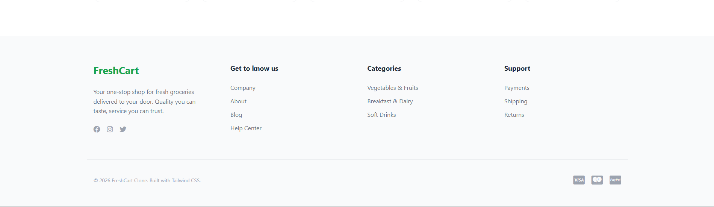
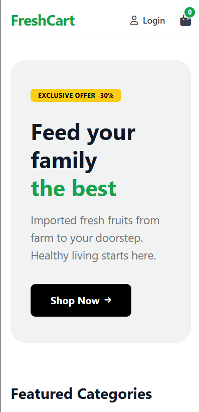
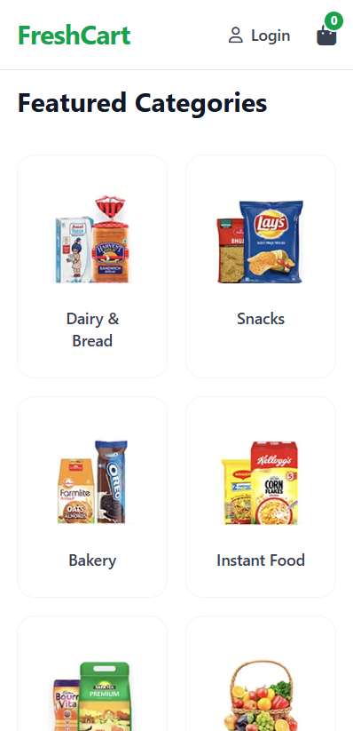
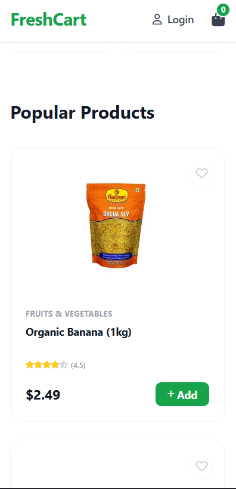

# FreshCart eCommerce Website Clone

A responsive grocery and eCommerce landing page clone of the FreshCart template. This project was developed to demonstrate semantic HTML structure and responsive web design using Tailwind CSS.

--- 

## Technical Requirements Fulfilled

* **Clean and Semantic HTML**: Utilized header, main, section, and footer tags for accessibility and SEO.
* **Full Responsiveness**: Implemented a mobile-first approach using Tailwind CSS breakpoints to ensure the layout adapts to mobile, tablet, and desktop screens.
* **CSS Framework**: Built entirely with Tailwind CSS via CDN for rapid utility-based styling.
* **Design Fidelity**: Followed the layout, color scheme, and typography of the provided reference link.

---

## Features

* **Responsive Navigation**: Includes a search bar that adjusts visibility based on device width and a sticky header for improved user experience.
* **Hero Banner**: A high-impact promotional section with call-to-action buttons designed for engagement.
* **Category Grid**: A dynamic grid system showing 6 items on desktop, 3 on tablets, and 2 on mobile devices for optimal viewing.
* **Product Cards**: Feature-rich cards including hover transitions, badge overlays for discounts, and interactive buttons for seamless shopping.
* **Footer**: A multi-column layout providing site information, navigation links, and social media connections.
* **Mobile-First Design**: Prioritizes mobile experience with graceful scaling to larger screens.

---

## Technologies Used

* HTML5
* Tailwind CSS (via CDN)
* FontAwesome Icons
* Responsive Design Principles

---

## Project Structure

```
freshcart-clone/
│ ── images/
│      ├── desktop1.png      (Desktop Landing Page)
│      ├── desktop2.png      (Desktop Categories & Products)
│      ├── desktop3.png      (Desktop Footer)
│      ├── mobile1.png       (Mobile Header & Navigation)
│      ├── mobile2.png       (Mobile Hero & Content)
│      └── mobile3.png       (Mobile Footer)
├── index.html                (Main landing page)
└── README.md                 (Project documentation)
```

---

## Installation and Setup

1. **Open the project in your browser:**
   Simply open `index.html` in any modern web browser (Chrome, Firefox, Safari, Edge, etc.)

2. **No additional dependencies required** - All styles are loaded via Tailwind CSS CDN.

---

## Screenshots

### Desktop View

The desktop experience showcases the full-featured layout with optimal spacing and multi-column grids.


*Desktop Landing Page with Hero Banner and Navigation*


*Desktop View with Product Categories and Grid Layout*


*Desktop Footer with Multi-Column Information*

### Mobile View

The mobile experience ensures usability on smaller screens with touch-friendly elements and optimized layouts.


*Mobile Header with Responsive Navigation*


*Mobile Hero Section and Content Layout*


*Mobile Footer with Stacked Columns*

---

## Responsive Breakpoints

The project utilizes Tailwind CSS breakpoints for seamless responsiveness:

* **Mobile**: Default styling for screens under 640px
* **Tablet**: Optimized layout for screens between 640px and 1024px
* **Desktop**: Full-featured layout for screens above 1024px

---

## Key Design Decisions

* **Mobile-First Approach**: Started with mobile design and progressively enhanced for larger screens
* **Semantic HTML**: Used proper HTML5 elements for better accessibility and SEO performance
* **Utility-First CSS**: Leveraged Tailwind's utility classes for rapid development and consistent styling
* **Accessibility**: Implemented proper alt text for images and semantic heading hierarchy

---

## Browser Compatibility

This project has been tested and works on:

* Chrome (Latest)
* Firefox (Latest)
* Safari (Latest)
* Mobile browsers (Chrome Mobile, Safari iOS)

---

## Future Enhancements

* Add JavaScript functionality for interactive features (filtering, cart functionality)
* Implement local storage for shopping cart persistence
* Add product detail pages
* Integrate with backend API for dynamic product data
* Implement user authentication and account management
* Add payment gateway integration

---

## Disclaimer

This project is for educational purposes as part of a Web Development assignment. All image assets are used for demonstration based on the provided reference link. This is a static HTML/CSS implementation meant to demonstrate design skills and responsive web development concepts.

---

## Author

Created by: Mr.Melan Parajuli

---
